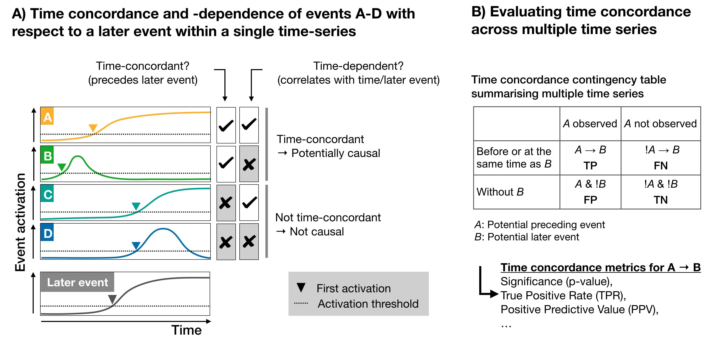
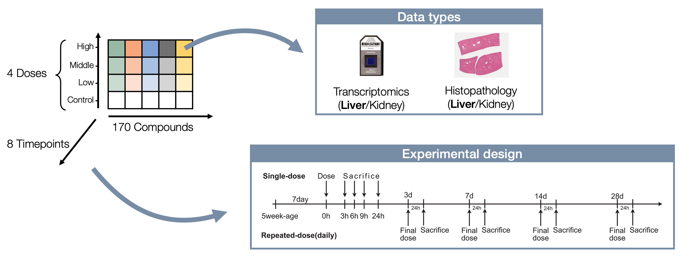
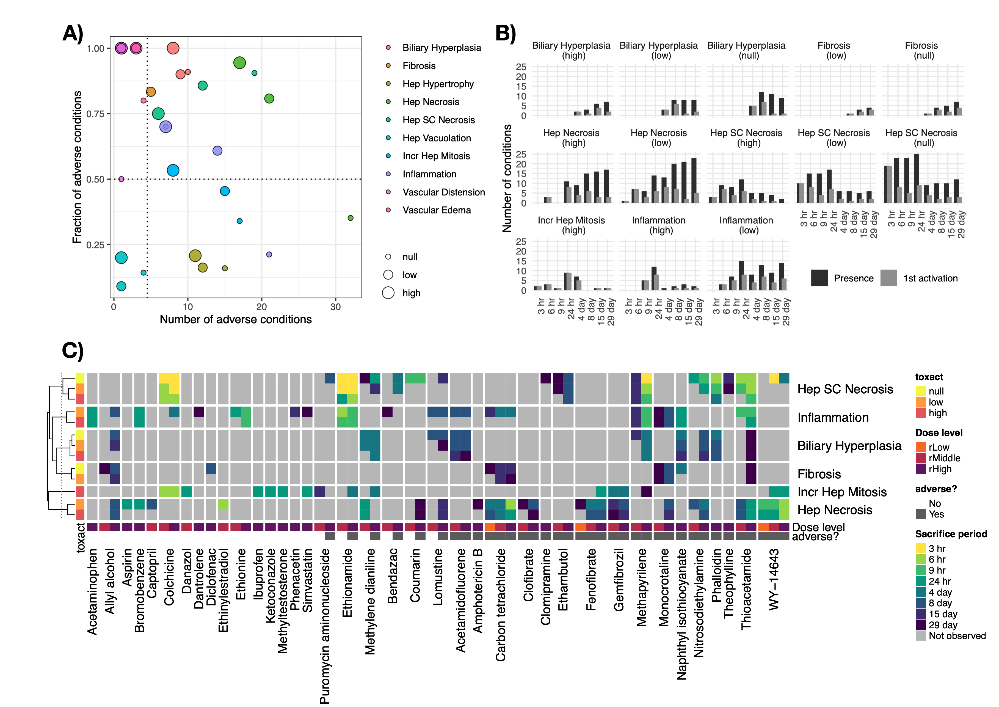

## Introduction
One source of evidence for causality between two events is whether they are consistently found in the same order over time or, in short, whether they are time-concordant. We present an automatable, data-driven framework to quantify and characterize time concordance across a large set of time-series providing a novel angle to prioritize mechanistically relevant events. As a case study, we used the TG-GATEs in vivo liver data from repeat-dose studies in rats and quantified time concordance between gene expression-derived events and later adverse histopathology indicating Drug-Induced Liver Injury (DILI). This app presents the results of the paper and allows further exploration of time concordanec in the TG-GATEs data. [insert link here]
  

## App functions

#### 1) <i class="fas fa-dot-circle"></i>  Identify preceding events for defined histopathology
Here, users can explore the time concordance of different types of events (TFs, Pathways, Histopathology) preceding adverse histopathology. While in our analysis adverse histopathology was defined as a set of different histopathological findings, users can also supply their own definition, e.g. focussing only on fibrosis or biliary hyperplasia, and study events of interest based on this.

#### 2) <i class="fas fa-arrows-alt-h"></i> Look up interaction between 2 events of interest
Once 2 events of interest are identified, e.g. based on time concordance analysis from the 1st tab but also based on expert knowledge, the relation between both events can be analysed further in this 2nd tab.This will provide an overview of time series where any of the given events is observed, providing further insight into when each event was activated in each time-series.
 
## Background
#### The Open TG-GATEs database
The [Open TG-GATEs database](https://doi.org/10.1093/nar/gku955) contains transcriptomics, histopathology as well as additional data from single-and repeat-dose studies in rats across multiple doses and timepoints. The data was accessed through the [Life Science Database Archive](https://dbarchive.biosciencedbc.jp/en/open-tggates/download.html).

#### Defintion of adverse histopathology
in order to consider both severity and frequency of events in a single numerical output measure. These are based on the lesion severity per animal which was first converted to a numerical scale (normal = 0, minimal = 1, slight = 2, moderate = 3, marked or severe = 4) and then summarised across all biological replicates by mean as an aggregate measure for lesion frequency and severity.

## Citation

[Deriving time-concordant event cascades from gene expression data: A case study for Drug-Induced Liver Injury (DILI)](https://doi.org/10.1371/journal.pcbi.1010148)
Anika Liu, Namshik Han, Jordi Munoz-Muriedas, Andreas Bender
PLOS Computational Biology 2022 Jun 10;18(6):e1010148.

The app was developed by Anika Liu (<a href="mailto:al862@cam.ac.uk" target="_blank"><i class="far fa-paper-plane"></i></a>) under the supervision of Dr. Andreas Bender, Dr. Namshik Han and Dr. Jordi Munoz-Muriedas. The app repository is available in  [Github](https://github.com/anikaliu/DILICascades_App).
